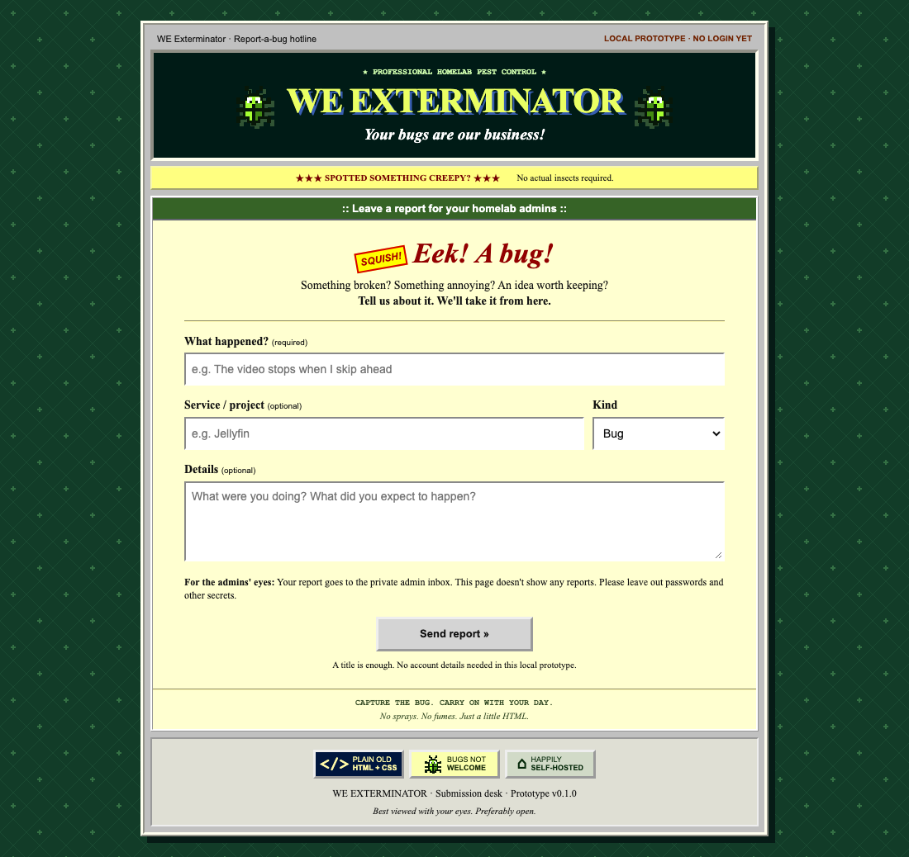
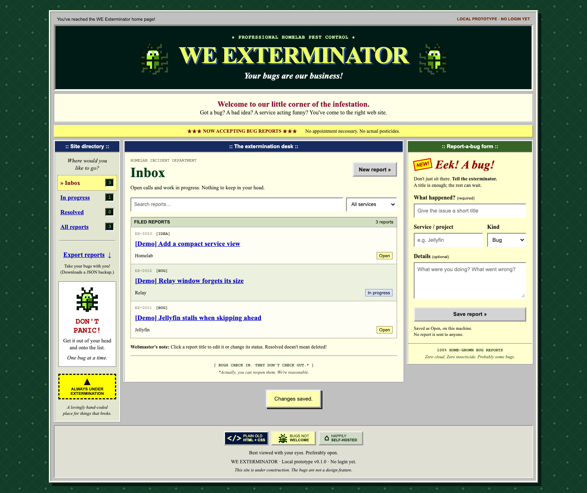

# WE exterminator

**Your bugs are our business.**

Exterminator is a small, self-hosted bug and feedback tracker for a homelab. When something breaks while you're using a service, write it down, get back to what you were doing, and deal with it later. No more trying to remember which player froze or which button did nothing.

It looks like an extermination company made its first website in 1997. Under the tiled wallpaper and pixel bugs, it's a simple reporting form and an admin inbox.

> **v0.2.0 · Native Debian 13 amd64 release.** [Download the package](https://github.com/murmuur22/exterminator/releases/tag/v0.2.0) and follow the [SSH installation guide](docs/deployment.md). Installation, reboot, update/rollback and local Relay Gateway integration were tested in a disposable Debian VM on the development laptop. Your real gateway/network configuration remains an operator responsibility.

## Two doors. One inbox.

### For users: report a problem

A short title is all you need. Optionally add the service name, choose Bug / Feedback / Idea, and describe what happened. Submit, get a confirmation, and carry on.

There is no report browser, history, admin link, or list of other people's services on this page.



### For admins: work through the list

New reports arrive in one inbox. Search them, filter by service, edit the details, and move them between **Open**, **In progress**, and **Resolved**. Resolving a report keeps it in the history; you can reopen it later.



*Screenshots come from the actual running prototype. The reports labeled `[Demo]` are made-up test fixtures, not reports from a real homelab.*

## What it does today

- Quick capture for bugs, feedback, and ideas.
- Separate user-facing form and admin tracker on different ports.
- Persistent SQLite storage shared by both interfaces.
- Search, service filters, editing, and resolve/reopen.
- JSON export of all reports from the admin interface.
- Responsive layouts for smaller windows and phones.
- Local assets: no CDN fonts, analytics, or external runtime API calls.

It deliberately leaves out attachments, assignments, AI triage, notifications, and complex project management. The goal is to get the issue out of your head, not give you another system to manage.

## How the two interfaces connect

```text
Submission form :8742 ── save report ──┐
                                     ├── SQLite database
Admin tracker   :8741 ── manage ──────┘
```

These are separate HTTP applications, not just two pages with hidden buttons. The submission server has no report-list, detail, editing, or export routes. It returns only a success acknowledgment after saving a report—not a report ID or existing content.

Both interfaces work without Relay. There is no dependency on Relay's database or accounts.

## Where Relay and Tailscale fit

The intended deployment is behind an existing access-controlled environment:

- Regular users can reach **Relay**, but not the underlying service ports directly.
- Relay grants everyone the **Report a problem** app and grants only admins the **Admin** app.
- Relay's Gateway forwards requests to the appropriate Exterminator listener.
- Tailscale/network rules restrict the paths to Relay and the backend services.

In that model, Exterminator doesn't need a second set of user accounts. Authorization lives at the gateway and network boundary. Other services can still require their own logins.

**That is the design, not a deployment claim.** Different ports do not authenticate users. Native Relay launchers alone would not enforce backend access. Before enabling remote use, the gateway grants and direct-access restrictions must be implemented and tested. Tailscale rules do not protect ordinary LAN traffic that bypasses Tailscale.

## Run the local prototype

Install [uv](https://docs.astral.sh/uv/getting-started/installation/) and Git. uv can supply the required Python 3.11+ environment.

```sh
git clone https://github.com/murmuur22/exterminator.git
cd exterminator
uv sync --locked
uv run python app.py
```

Open the admin tracker at **http://127.0.0.1:8741**.

In a second terminal, from the same project directory:

```sh
uv run python submit.py
```

Open the submission form at **http://127.0.0.1:8742**.

Both run on this computer only. Stop each process with **Ctrl-C**. They do not install background services, seed demo reports, or change network settings.

### Current safety boundary

There is **no login** in this prototype. Other users or processes on the same computer may access it. Use a trusted machine and don't put passwords or secrets in reports.

Do not expose these development servers through a LAN bind, reverse proxy, tunnel, or port forwarding as-is. Loopback/Host/Origin checks and a restrictive content security policy are present; embedding is currently blocked. Deployment needs deliberate gateway/network configuration and compatibility work, not just changing a port.

## Your data

In development mode, reports are stored in `data/reports.sqlite3`, created on first start and excluded from Git. The installed Debian service instead uses `/var/lib/exterminator/reports.sqlite3`; see the deployment guide for its paired update/rollback snapshots.

- **Export:** use **Export reports** in the admin interface to download every report as JSON, regardless of current filters. There is no JSON import screen yet.
- **Backup:** stop both listeners and copy `data/reports.sqlite3` to a private backup location.
- **Restore:** stop both listeners, preserve the current database, replace it with your backup, and restart.

Treat reports and exports as private. There are no automatic backups or database migrations yet.

## Development and tests

Small stack: **Python, Flask, SQLite, HTML, CSS, and vanilla JavaScript.** No frontend build step.

```sh
uv sync --locked
uv run playwright install chromium
uv run pytest -q
```

The tests use temporary databases and local servers, including a real browser submission-to-admin workflow. They do not touch your normal reports. See [testing notes](docs/testing.md) for coverage and limitations, and the [changelog](CHANGELOG.md) for changes.

## Native Debian deployment

The supported packaging target is **Debian 13 amd64**, using Gunicorn and two hardened systemd service instances. Config, data, backups, and root-owned releases have separate directories. The default remains loopback-only; remote access requires an explicitly configured external access boundary.

See [deployment and rollback instructions](docs/deployment.md) for release downloads, exact apt prerequisites, installing/updating over SSH, loopback same-VM Relay configuration, and explicit database/config rollback. Do not use the development servers as a production service.

The [qualification report](docs/qualification.md) records the real local Debian and Relay tests and their limits. The installer never configures Relay, Tailscale, firewalls, or neighboring services.

## Project status

v0.2.0 is the narrow operator-managed release for a protected Debian 13 amd64 homelab. It has no built-in accounts, Docker requirement or in-app updater. Live installation and gateway/network setup remain manual.

A project license has not been selected yet. Public source availability is not an open-source license grant.
